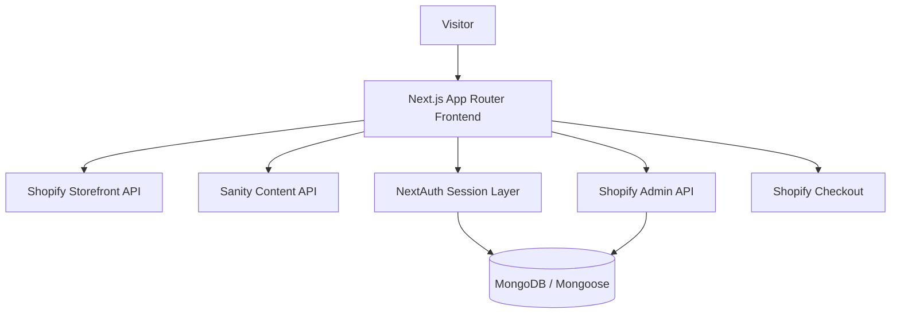
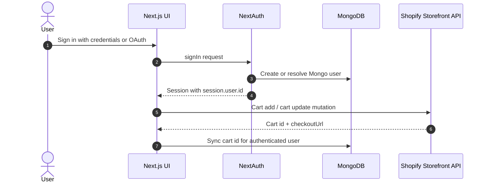
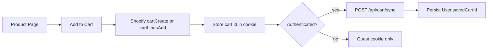
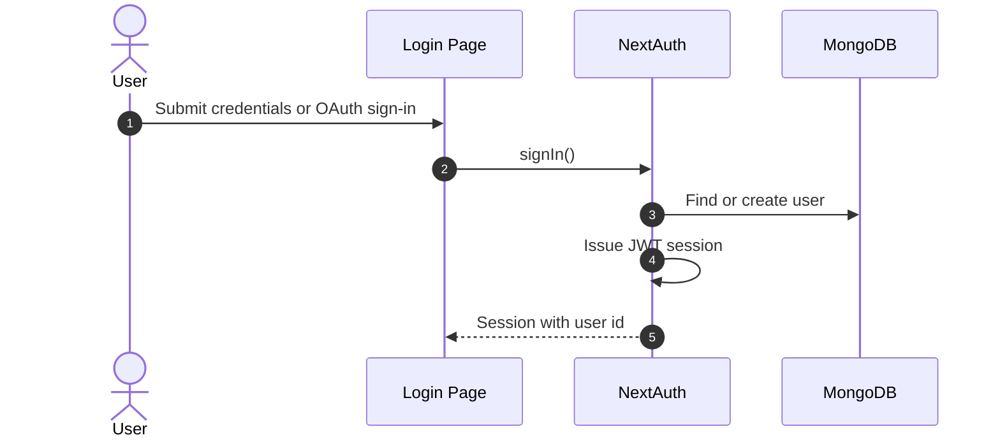
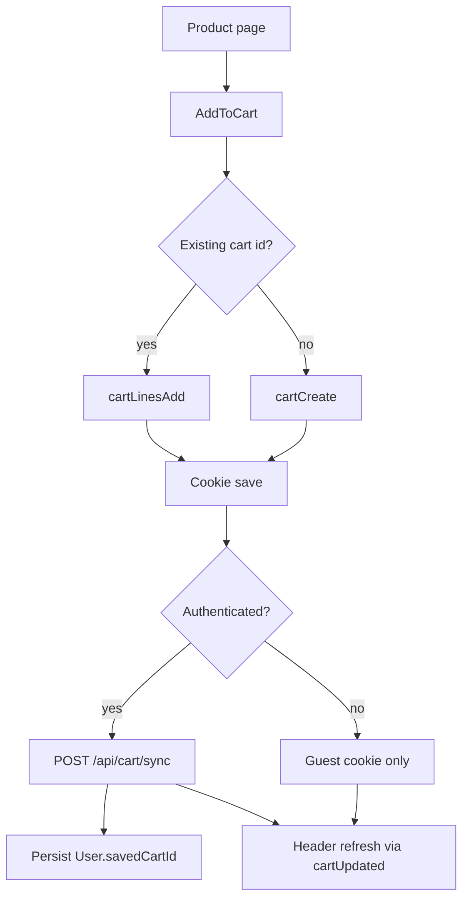
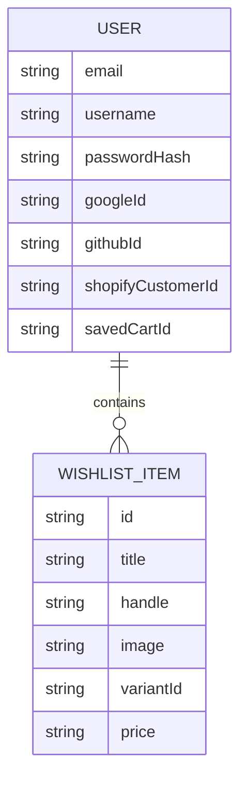
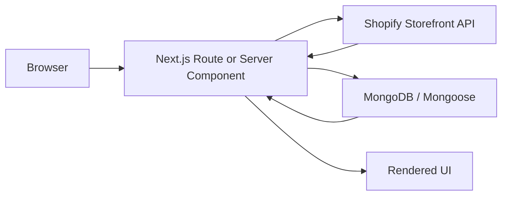
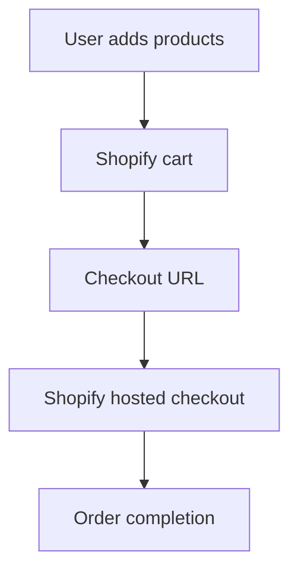

<div align="center">

# Headless Shopify Store

**A polished headless snowboard storefront built with Next.js, Shopify, Sanity, MongoDB, and NextAuth.**


<p>
  <a href="https://github.com/Shazia-Zameer-999/shopify_demo/stargazers"></a>
  <a href="https://github.com/Shazia-Zameer-999/shopify_demo/network/members"></a>
  <a href="https://github.com/Shazia-Zameer-999/shopify_demo/issues"></a>
  <a href="https://github.com/Shazia-Zameer-999/shopify_demo/commits/main"></a>
  
  
</p>

<p>
  
  
  
  
  
  
  
  
</p>

</div>

---
## About The Project


This repository is a headless snowboard storefront built around a simple idea: keep the customer experience fast and polished while separating content, commerce, and identity into focused systems.

It is designed for a retail storefront that needs:

- a visually rich homepage with editorial content
- Shopify-backed products, search, carts, and checkout
- authenticated wishlist and account features
- MongoDB-backed users and order lookup
- a lightweight content layer for hero and featured sections

The result is a storefront that feels close to a premium commerce site rather than a generic demo. The homepage is driven by Sanity, the catalog and checkout are powered by Shopify, and user identity is handled by NextAuth plus MongoDB.

---
## Key Features

✅ Headless Shopify Storefront

✅ Secure Authentication

✅ Guest & Authenticated Cart

✅ Wishlist

✅ Shopify Checkout

✅ Sanity CMS

✅ Product Search

✅ Responsive Design

✅ Account Dashboard

✅ Order History

## Why Headless?

This project separates commerce, content, and authentication into independent services.

Benefits include:

- Faster storefront performance
- Independent CMS
- Flexible frontend
- Better SEO
- Easier scalability
- Modern developer experience
## Highlights

| Capability | What it does |
|---|---|
| Headless storefront | Renders products through the Shopify Storefront API with server-side product pages |
| Content management | Uses Sanity for homepage hero/content and a separate Sanity Studio workspace |
| Authenticated users | Supports Google, GitHub, and username/password login through NextAuth |
| Cart persistence | Stores cart ids in cookies and links authenticated carts to MongoDB users |
| Wishlist | Persists wishlist items for signed-in users and supports guest storage fallback |
| Orders | Reads customer orders through the Shopify Admin API |
| Search | Queries Shopify products from a dedicated search endpoint |
| Responsive UI | Uses Next.js App Router, Tailwind CSS 4, and motion-based UI components |

---

## Live Demo

Frontend:
https://shop.datendiva.me

Shopify Checkout:
https://store.datendiva.me

---


## Tech Stack

| Layer | Technologies |
|---|---|
| Frontend | Next.js 16, React 19, React DOM 19, Tailwind CSS 4, motion, lucide-react, styled-components |
| Auth | NextAuth 4, bcryptjs, cookies-next, js-cookie |
| Database | MongoDB, Mongoose |
| Commerce | Shopify Storefront API, Shopify Admin API |
| Content | Sanity, Sanity Studio, @sanity/client, @sanity/image-url, @sanity/vision |
| Tooling | ESLint 9, eslint-config-next, PostCSS, npm scripts |

---

## Architecture







---

## Folder Structure

<details>
<summary>Expand the actual repository tree</summary>

```text
.
├── app
│   ├── account
│   │   └── page.jsx
│   ├── api
│   │   ├── account
│   │   │   ├── change-password
│   │   │   │   └── route.js
│   │   │   └── orders
│   │   │       └── route.js
│   │   ├── auth
│   │   │   ├── [...nextauth]
│   │   │   │   └── route.js
│   │   │   └── register
│   │   │       └── route.js
│   │   ├── cart
│   │   │   ├── count
│   │   │   │   └── route.js
│   │   │   └── sync
│   │   │       └── route.js
│   │   ├── search
│   │   │   └── route.js
│   │   ├── test-db
│   │   │   └── route.js
│   │   └── wishlist
│   │       ├── add
│   │       │   └── route.js
│   │       ├── clear
│   │       │   └── route.js
│   │       ├── count
│   │       │   └── route.js
│   │       ├── get
│   │       │   └── route.js
│   │       ├── merge
│   │       │   └── route.js
│   │       └── remove
│   │           └── route.js
│   ├── auth
│   │   ├── login
│   │   │   ├── LoginPageContent.jsx
│   │   │   └── page.jsx
│   │   └── register
│   │       └── page.jsx
│   ├── cart
│   │   └── page.js
│   ├── products
│   │   └── [handle]
│   │       └── page.js
│   ├── search
│   │   └── page.js
│   ├── wishlist
│   │   └── page.js
│   ├── globals.css
│   ├── layout.js
│   └── page.js
├── components
│   ├── AddToCart.js
│   ├── Animated_text.js
│   ├── CartActions.js
│   ├── Gradient.js
│   ├── Header.js
│   ├── HeroSlider.js
│   ├── ImageGallery.js
│   ├── Pagination.js
│   ├── ProductCard.js
│   ├── Scroller.js
│   ├── SearchBar.js
│   ├── SessionProviderWrapper.js
│   ├── Test.js
│   └── Wishlist.js
├── lib
│   ├── auth.js
│   ├── cartContext.js
│   ├── mongoose.js
│   ├── sanity.client.js
│   ├── sanity.server.js
│   ├── sanityQueries.js
│   ├── shopify-admin.js
│   └── wishlistClient.js
├── models
│   ├── Cart.js
│   └── User.js
├── public
│   └── images
├── studio
│   ├── eslint.config.mjs
│   ├── package.json
│   ├── README.md
│   ├── sanity.cli.js
│   ├── sanity.config.js
│   └── schemaTypes
│       ├── featuredProduct.js
│       ├── heroSlide.js
│       ├── heroSlider.js
│       ├── index.js
│       └── siteSettings.js
├── utils
│   ├── storage.client.js
│   ├── storage.js
│   └── storage.server.js
├── eslint.config.mjs
├── jsconfig.json
├── next.config.mjs
├── package.json
├── postcss.config.mjs
└── README.md
```

</details>

---

## Features

| Feature | Implementation |
|---|---|
| Homepage merchandising | Sanity-powered hero slider plus Shopify product grid |
| Product detail pages | Server-rendered product pages with gallery, pricing, stock, and add-to-cart actions |
| Search | Shopify-backed search endpoint and header search UI |
| Auth | Google, GitHub, and credentials login with Mongo-backed sessions |
| Cart | Guest cookie cart plus authenticated cart sync to MongoDB |
| Wishlist | Authenticated wishlist API and guest localStorage fallback |
| Orders | Shopify Admin API lookup for customer orders |
| Account pages | Login, register, account, password change, and order routes |
| Responsive navigation | Sticky header, search, category menus, and scroll progress indicators |

---

## Screens And Content Sources

| Area | Source |
|---|---|
| Homepage hero | Sanity Studio content |
| Product catalog | Shopify Storefront API |
| Cart state | Shopify cart plus browser cookie plus MongoDB user sync |
| Wishlist | MongoDB for signed-in users, localStorage for guests |
| Orders | Shopify Admin API |

---

## Installation

### Prerequisites

- Node.js 20 or newer
- npm
- MongoDB connection string
- Shopify store access tokens
- Sanity project credentials
- Google and GitHub OAuth app credentials if you want social login

### macOS / Linux

```bash
git clone https://github.com/Shazia-Zameer-999/shopify_demo.git
cd shopify_demo
npm install
npm run dev
```

### Windows PowerShell

```powershell
git clone https://github.com/Shazia-Zameer-999/shopify_demo.git
cd shopify_demo
npm install
npm run dev
```

### Sanity Studio

```bash
cd studio
npm install
npm run dev
```

---

## Environment Variables

Create a root `.env.local` from the example file and provide the following values.

| Variable | Purpose |
|---|---|
| `MONGODB_URI` | MongoDB connection string used by Mongoose |
| `GOOGLE_CLIENT_ID` | Google OAuth client id for NextAuth |
| `GOOGLE_CLIENT_SECRET` | Google OAuth client secret for NextAuth |
| `GITHUB_CLIENT_ID` | GitHub OAuth client id for NextAuth |
| `GITHUB_CLIENT_SECRET` | GitHub OAuth client secret for NextAuth |
| `NEXT_PUBLIC_SHOPIFY_STORE_DOMAIN` | Shopify store domain used for Storefront and Admin API calls |
| `NEXT_PUBLIC_SHOPIFY_STOREFRONT_ACCESS_TOKEN` | Shopify Storefront API token |
| `SHOPIFY_ADMIN_API_ACCESS_TOKEN` | Shopify Admin API token used for orders and customer lookup |
| `NEXT_PUBLIC_SANITY_PROJECT_ID` | Sanity project id used by the storefront |
| `NEXT_PUBLIC_SANITY_DATASET` | Sanity dataset name |
| `NEXT_PUBLIC_SANITY_API_VERSION` | Sanity API version |
| `SANITY_API_TOKEN` | Optional token for preview or private Sanity queries |


## Running Locally

### Root App

```bash
npm run dev
```

Expected result:

- Next.js starts the storefront at `http://localhost:3000`
- the homepage loads with the Shopify-backed catalog and Sanity hero
- authenticated features become available once session variables are configured

### Production Build

```bash
npm run build
npm run start
```

### Lint

```bash
npm run lint
```

### Sanity Workspace

```bash
cd studio
npm run dev
npm run build
npm run deploy
```

---

## API Documentation

| Method | Route | Description | Auth | Response |
|---|---|---|---|---|
| GET / POST | `/api/auth/[...nextauth]` | NextAuth entrypoint for OAuth and credentials login | Session-based | Session or auth callback responses |
| POST | `/api/auth/register` | Creates a Mongo user with a bcrypt-hashed password | Public | JSON success / error |
| POST | `/api/account/change-password` | Updates the current user password | Required | JSON success / error |
| GET | `/api/account/orders` | Fetches the current user orders from Shopify Admin API | Required | JSON orders |
| POST | `/api/cart/count` | Resolves the active cart and returns Shopify cart data for the header | Session-aware | JSON cart or null |
| POST | `/api/cart/sync` | Persists the active cart id to the signed-in user and cookie | Required | JSON ok / error |
| GET | `/api/search?q=...` | Searches Shopify products for the header search UI | Public | JSON products |
| GET | `/api/test-db` | Debug endpoint returning a Mongo user count | Public debug | JSON count |
| GET | `/api/wishlist/get` | Returns the signed-in user wishlist | Required | JSON wishlist |
| GET | `/api/wishlist/count` | Returns the signed-in user wishlist count | Required | JSON count |
| POST | `/api/wishlist/add` | Adds an item to the wishlist | Required | JSON success / error |
| DELETE | `/api/wishlist/remove` | Removes one wishlist item | Required | JSON success / error |
| DELETE | `/api/wishlist/clear` | Clears the wishlist | Required | JSON success / error |
| POST | `/api/wishlist/merge` | Merges guest wishlist data into a logged-in account | Required | JSON merged wishlist |

<details>
<summary>Endpoint notes</summary>

- Cart and search routes query Shopify Storefront GraphQL.
- Orders route uses Shopify Admin REST endpoints.
- Wishlist and account routes use MongoDB-backed user records.
- `/api/test-db` is a debug route and should not be exposed as a product feature.

</details>

---

## Authentication

Authentication is implemented with NextAuth in [lib/auth.js](lib/auth.js).

- Google OAuth and GitHub OAuth are supported.
- Credentials login accepts username or email.
- Passwords are hashed with bcryptjs.
- The JWT callback resolves or creates the Mongo user and exposes `session.user.id`.
- The session callback adds `session.user.shopifyCustomerId` for downstream Shopify lookups.
- Account registration is handled separately in the register route, then login is performed through NextAuth.



---

## Cart Flow

The live cart is Shopify-first, but the app adds a persistence layer for authenticated users.

- Guests use the `shopify_cart_id` cookie.
- Signed-in users prefer `User.savedCartId`.
- If a guest cart exists during login, it can be adopted into the user record.
- Add-to-cart creates or updates a Shopify cart through the Storefront API.
- Quantity changes and removals call Shopify cart mutations.
- The header listens for `cartUpdated` events and refreshes the cart count.



---

## Wishlist Flow

Wishlist handling mirrors the cart pattern, but the persistence target is the wishlist array on the `User` model.

- Signed-in users use the wishlist API routes.
- Guests use localStorage.
- The header listens for `wishlistUpdated` events.

---

## Database

### Active Models

| Model | Role |
|---|---|
| `User` | Primary identity, auth metadata, `savedCartId`, Shopify customer id, wishlist items |
| `Cart` | Present in the codebase, but not used by the active cart flow |

### User Schema

The active user document stores:

- `email`
- `username`
- `passwordHash`
- `googleId`
- `githubId`
- `shopifyCustomerId`
- `savedCartId`
- `wishlist[]`

### Relationship Diagram



### Indexes And Persistence Notes

- MongoDB connection reuse is cached in `lib/mongoose.js`.
- `email` and `username` are unique with sparse indexes.
- The cart persistence path currently uses `User.savedCartId` rather than the unused `Cart` model.

---

## Shopify Integration

Shopify is used in two layers:

- **Storefront API** for catalog, product pages, search, cart creation, cart line updates, and cart lookup.
- **Admin API** for customer lookup and order retrieval.

### Request Lifecycle



### Payment Flow

There is no custom payment processor in this repository.
Checkout is delegated to Shopify through the cart `checkoutUrl`.



---

## Performance

The repository already includes several performance-oriented choices:

- server-rendered product and cart pages
- `cache: "no-store"` on fresh Shopify reads where live data matters
- cursor-based pagination on product listing queries
- global Mongo connection reuse
- `next/image` remote pattern allowlists for optimized media delivery
- route-level dynamic rendering where auth/session state is involved

The cart header also refreshes reactively through custom events and polling, which keeps the UI responsive even when mutations happen outside the current page.

---

## Security

The app includes several security-positive patterns:

- bcrypt password hashing for credentials login
- NextAuth session management with JWT strategy
- auth-gated server routes for account, cart sync, orders, and wishlist operations
- `sameSite: "lax"` cookies
- secure cookies in production
- server-side Mongo lookups instead of trusting client-only identity state
- Shopify tokens kept in environment variables

Additional hardening that may be worth adding later:

- rate limiting on auth and mutation routes
- stricter input validation on API payloads
- a production `NEXTAUTH_SECRET`
- explicit `NEXTAUTH_URL` in deployment environments

---

## Error Handling

Error handling is implemented at the route and component level:

- Shopify fetch failures return safe empty payloads in public-facing routes.
- Auth-required routes return 401 or 404 where appropriate.
- Cart mutations now fail loudly when Shopify returns `userErrors` or no cart payload.
- The UI logs cart and wishlist errors to the console and keeps the app usable.

---

## Deployment

No Dockerfile, compose file, or GitHub Actions workflow is committed in this repository.

The app appears ready for a standard Next.js deployment, and the Sanity Studio can be deployed independently from the `studio/` workspace.

Suggested deployment split:

- storefront: Vercel or any Next.js host
- MongoDB: Atlas
- Sanity Studio: Sanity hosting or separate static deploy
- Shopify: existing store configuration

---

## Future Improvements

- Add a committed `.env.example` template and deployment checklist if you plan to share the repo publicly.
- Add a real screenshot set under `public/` or `docs/`.
- Surface Shopify `userErrors` in the UI with friendlier messages.
- Replace the header polling loop with a more event-driven or server-sent strategy.
- Remove or repurpose unused code paths such as the `Cart` model and `wishlistClient` if they remain unreferenced.
- Resolve the Sanity schema naming mismatch between the hero-related document types if it is still intentional.

---

## Contributing

Contributions are welcome.

1. Fork the repository.
2. Create a feature branch.
3. Make focused, well-tested changes.
4. Run `npm run lint` and `npm run build` before opening a pull request.
5. Include screenshots or short recordings when the change affects UI.

If you touch the Sanity workspace, run the corresponding Studio checks in `studio/` as well.

---

## Credits

Built with:

- [Next.js](https://nextjs.org)
- [React](https://react.dev)
- [Shopify Storefront API](https://shopify.dev)
- [Shopify Admin API](https://shopify.dev)
- [Sanity](https://www.sanity.io)
- [MongoDB](https://www.mongodb.com)
- [NextAuth](https://next-auth.js.org)
- [Tailwind CSS](https://tailwindcss.com)
- [Lucide React](https://lucide.dev)
- [bcryptjs](https://www.npmjs.com/package/bcryptjs)

Media sources used in the UI include Shopify-hosted product data, Sanity content, Unsplash imagery, and Pinterest-hosted imagery.

---


<div align="center">

**Made with ❤️ by Shazia-Zameer-999**

</div>
